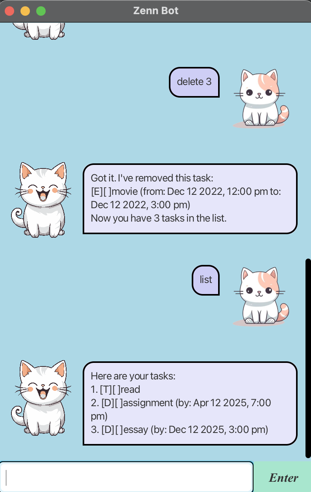
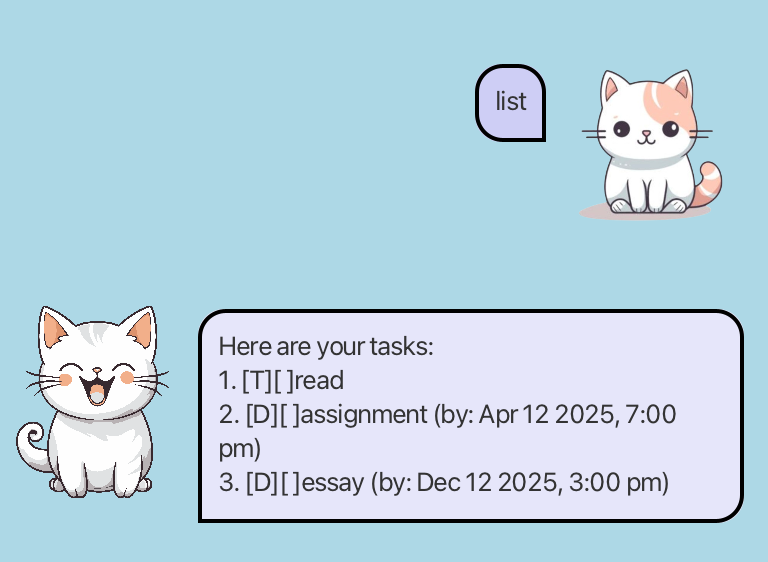
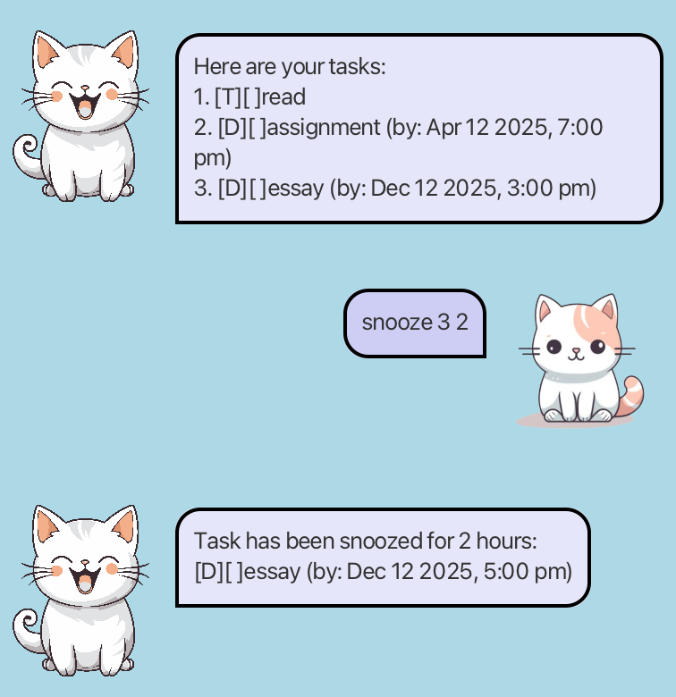
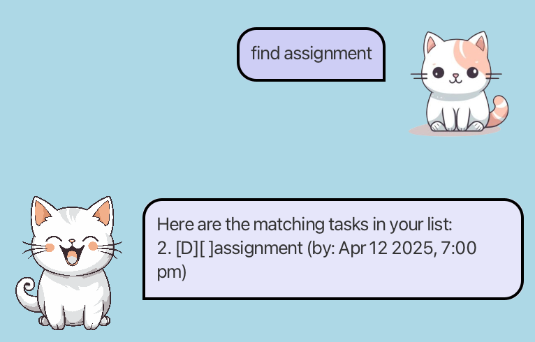

# Zenn Bot User Guide




Introducing Zenn Bot, your smart task management assistant, designed to help you stay organised and productive.

## Getting Started

### List all tasks : `list`
List all completed and uncompleted task.

**Format:**
```
list
```


### Add a todo task : `todo`
Add a new task to the task list.

**Format:**
```
todo <description>
```
***Example:***
```
todo write an essay
```

### Add a deadline task : `deadline`
Add a new task with a deadline to the task list.

**Format:**
```
deadline <description> /by <deadline>
```
**Note:**
* The deadline format is `dd/mm/yyyy HHmm`
* Deadline given cannot be in the past.

***Example:***
```
deadline assignment 1 /by 12/04/2025 1200
```

### Add an event task : `event`
Add a new task with a start date and end date to the task list.

**Format:**
```
event <description> /from <start_date> /to <end_date> 
```
**Note:**
* The start_date and end_date format is `dd/mm/yyyy HHmm`
* start_date and end_date given cannot be in the past.
* end_date cannot be before start_date.

***Example:***
```
event movie /from 12/04/2025 1200 /to 12/04/2025 1400
```

### Snooze a task : `snooze`
Postpone the deadline of the task by the specified number of hours. 

**Format:**
```
snooze <task_index> <number_of_hours>
```
**Note:**
* `snooze` can only be used for deadline and event task.

***Example:***
```
snooze 3 2
```


### Mark a task as completed : `done`
Mark a task at the given index as completed.

**Format:**
```
done <task_index>
```
***Example:***
```
mark 3
```

### Mark a task as uncompleted : `unmark`
Mark a task at the given index as uncompleted.

**Format:**
```
unmark <task_index>
```
***Example:***
```
unmark 3
```

### Delete a task : `delete`
Delete a task from the task list.

**Format:**
```
delete <task_index>
```
**Note:**
* `Delete` cannot be undone, you will have to add the task again. 

***Example:***
```
delete 3
```

### Find a task : `find`
Find tasks from the task list that contains the given word.

**Format:**
```
find <keyword>
```
***Example:***
```
find assignment
```


### Exiting the application : `bye`
Exits and close the application.

**Format:**
```
bye
```

## Automatic Saving of Data
* Zenn Bot saves all task in a txt file after every session.
* There is no need to save update manually.


